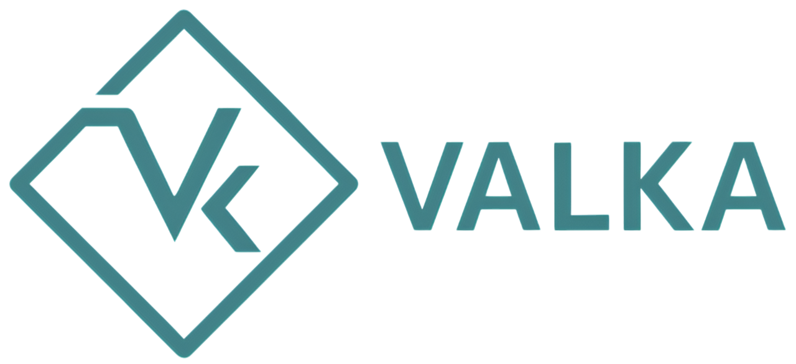

# Valka | Programming Language


[](https://choosealicense.com/licenses/mit/)



This programming language is a personal project I’m working on in my spare time to get familiar with LLVM technology. It’s heavily inspired by C and borrows some syntax from Rust. Enjoy!

## Build

To build the compiler `valkc` run this:

```bash
make
```
Soon, there will be build scripts available for: `Linux`, `MacOS`, `Windows`

## Usage/Examples

To compile a .vk source code run this:
```bash
./valkac file.vk
```
You can checkout the folder `samples/` which contains some examples.


## Documentation (W.I.P.)

[Documentation](https://www.youtube.com/watch?v=dQw4w9WgXcQ)


## Authors

- [@matteoepitech](https://www.github.com/matteoepitech)
